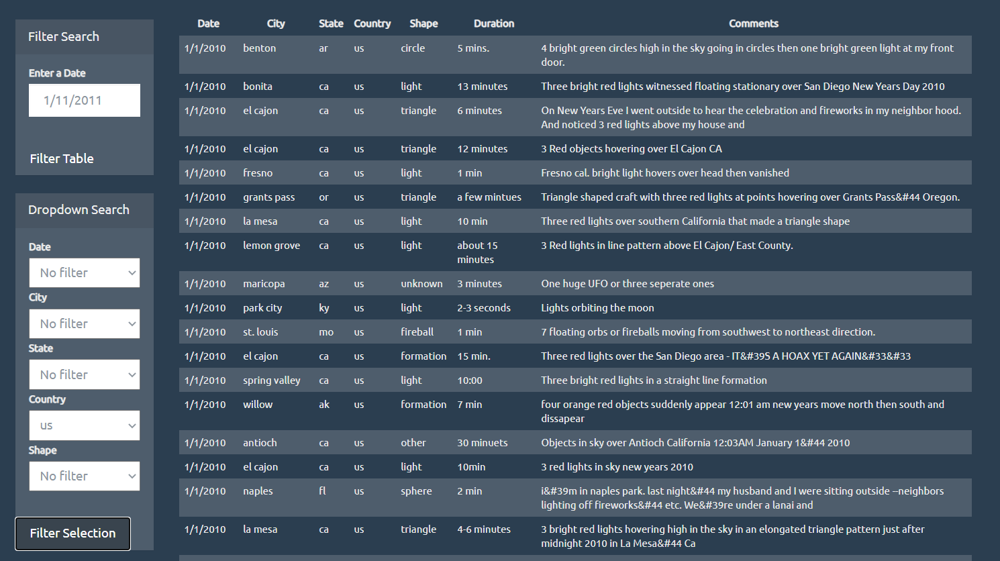

# JavaScript and DOM Manipulation

## Background

In this challenge a Javascript script was written to create a dynamic table that displays UFO sightings in the US and Canada.

To be able to easily sort through the data, multiple select dropdowns were created using JavaScript, HTML, CSS, and D3.js. The data can be filtered by selecting
the following table columns:

date/time
city
state
country
shape

In addition, the sighting table can be filtered by entering a specific date.

## Link: https://fabiola-c14.github.io/Javascript-Challenge/

